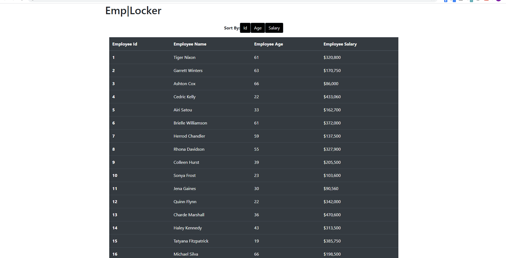

## Emp|Locker

## Applications Used
- React
- Bootstrap
- JavaScript
- Axios

## Summary of Project
- This application is a proof of concept for accessing an API through axios and manipulating the DOM and State through React. The user can sort the main page by Employee ID, Salary, or Age. This is completed using the useState hook within components/SearchBar.js. 

- The application utilizes two components and acceses one API call through the axios npm package. 

## Link to Deployed Project
https://mnorthup2207.github.io/EasiCuisi_recipe_API/.